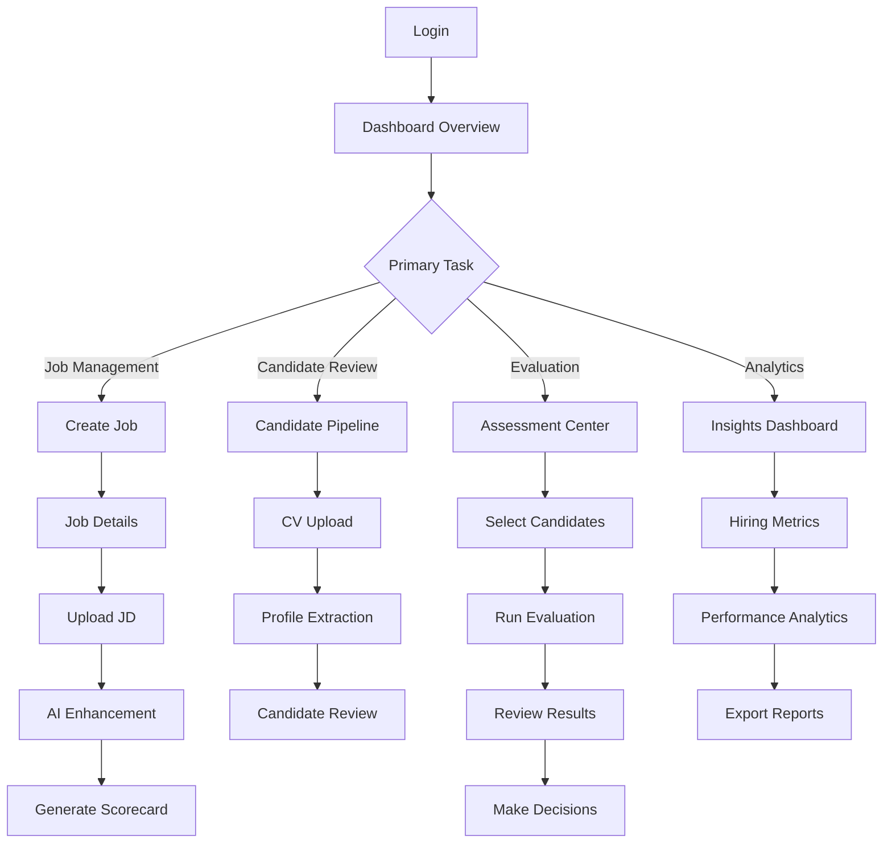
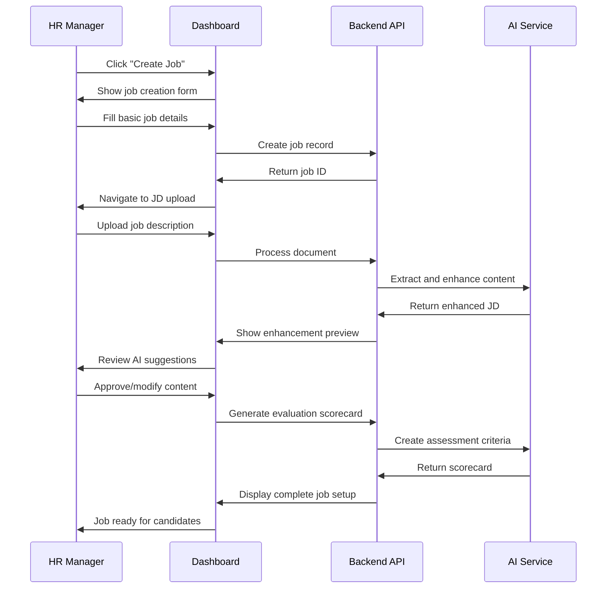
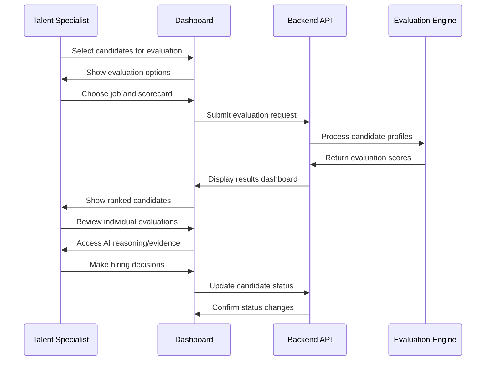

# 🎨 CARSA Lens Agent - Frontend UI/UX Design Strategy

**Document Version:** 1.0  
**Date:** January 2025  
**Project:** CARSA Lens Agent - Professional Recruitment Dashboard  
**Target Audience:** Corporate Hiring Teams & HR Professionals  
**Design Philosophy:** Enterprise-Grade, Intuitive, Modern

---

## 📋 Executive Summary

This document outlines the comprehensive UI/UX strategy for CARSA Lens Agent's frontend dashboard, designed for corporate hiring teams accustomed to enterprise-grade interfaces from Microsoft, Salesforce, and other industry leaders. Our approach emphasizes **user-centered design**, **professional aesthetics**, and **intuitive workflows** while leveraging the platform's robust AI capabilities.

**Key Objectives:**
- ✅ **Enterprise-Grade Experience** matching Fortune 500 standards
- ✅ **Intuitive Workflows** reducing learning curve for HR professionals
- ✅ **Mobile-Responsive Design** for modern workplace flexibility
- ✅ **Accessibility Compliance** following WCAG 2.1 guidelines
- ✅ **Performance Optimization** for smooth user experience

---

## 🎯 User-Centered Design Foundation

### Primary User Personas

#### **1. HR Manager (Primary Decision Maker)**
- **Profile**: 5-15 years HR experience, manages hiring strategies
- **Goals**: Efficient candidate evaluation, quality hiring decisions, process oversight
- **Pain Points**: Manual screening, bias in evaluation, time-consuming processes
- **Tech Comfort**: High - uses Salesforce, Workday, LinkedIn Recruiter daily

#### **2. Talent Acquisition Specialist (Power User)**
- **Profile**: 3-8 years recruiting experience, handles high-volume hiring
- **Goals**: Quick candidate processing, accurate matching, streamlined workflows
- **Pain Points**: CV screening bottlenecks, inconsistent evaluation criteria
- **Tech Comfort**: Very High - early adopter of recruitment technology

#### **3. Hiring Manager (Occasional User)**
- **Profile**: Department heads participating in hiring decisions
- **Goals**: Quick candidate review, collaborative decision-making
- **Pain Points**: Complex interfaces, time away from core responsibilities
- **Tech Comfort**: Medium-High - familiar with business applications

#### **4. Executive/C-Level (Strategic User)**
- **Profile**: Senior leadership monitoring hiring metrics
- **Goals**: Strategic insights, ROI visibility, compliance oversight
- **Pain Points**: Lack of actionable data, unclear hiring ROI
- **Tech Comfort**: Medium - prefers dashboards and executive summaries

### User Journey Mapping



---

## 🏗️ Information Architecture

### **Primary Navigation Structure**

#### **Level 1: Main Navigation**
```
🏠 Dashboard
💼 Jobs
👥 Candidates  
📊 Evaluations
📈 Analytics
⚙️ Settings
```

#### **Level 2: Feature Modules**

**💼 Jobs Module**
- All Jobs (List View)
- Create New Job
- Job Templates
- Job Description Library
- Scorecard Management

**👥 Candidates Module**
- Candidate Pipeline
- CV Upload Center
- Bulk Operations
- Candidate Profiles
- Document Management

**📊 Evaluations Module**
- Assessment Center
- Evaluation Queue
- Results Dashboard
- Comparative Analysis
- Decision Workflow

**📈 Analytics Module**
- Hiring Dashboard
- Performance Metrics
- Diversity Insights
- Time-to-Hire Analytics
- ROI Reports

### **Information Hierarchy**

```
Organization Level (Multi-tenant)
├── Department Level (Optional Grouping)
│   ├── Job Level
│   │   ├── Job Descriptions (Versioned)
│   │   ├── Scorecards
│   │   └── Applications
│   ├── Candidate Level
│   │   ├── Profile Data
│   │   ├── Documents
│   │   └── Evaluation History
│   └── Evaluation Level
│       ├── Scores & Rankings
│       ├── AI Insights
│       └── Decision Records
```

---

## 🎨 Visual Design System

### **Color Palette (Enterprise Professional)**

#### **Primary Colors**
```css
/* Primary Blue - Trust & Professionalism */
--primary-500: #0066CC;     /* Microsoft-inspired blue */
--primary-400: #338FE6;     /* Lighter variant */
--primary-600: #0052A3;     /* Darker variant */

/* Secondary Colors */
--secondary-500: #6B46C1;   /* Purple - Innovation */
--accent-500: #059669;      /* Green - Success/Positive */
--warning-500: #D97706;     /* Orange - Attention */
--error-500: #DC2626;       /* Red - Critical */
```

#### **Neutral Palette**
```css
/* Grayscale - Professional & Clean */
--neutral-50: #F9FAFB;      /* Background */
--neutral-100: #F3F4F6;     /* Light background */
--neutral-200: #E5E7EB;     /* Borders */
--neutral-400: #9CA3AF;     /* Placeholder text */
--neutral-600: #4B5563;     /* Secondary text */
--neutral-900: #111827;     /* Primary text */
```

### **Typography System**

#### **Font Stack**
```css
/* Primary Font - Modern Sans-Serif */
font-family: 'Inter', 'Segoe UI', 'Roboto', -apple-system, BlinkMacSystemFont, sans-serif;

/* Monospace - Code/Data Display */
font-family: 'JetBrains Mono', 'Monaco', 'Consolas', monospace;
```

#### **Type Scale**
```css
/* Heading Hierarchy */
--text-5xl: 3rem;      /* 48px - Page titles */
--text-4xl: 2.25rem;   /* 36px - Section headers */
--text-3xl: 1.875rem;  /* 30px - Card titles */
--text-2xl: 1.5rem;    /* 24px - Subsections */
--text-xl: 1.25rem;    /* 20px - Large body */
--text-lg: 1.125rem;   /* 18px - Body text */
--text-base: 1rem;     /* 16px - Default */
--text-sm: 0.875rem;   /* 14px - Small text */
--text-xs: 0.75rem;    /* 12px - Caption */
```

### **Spacing System (8px Grid)**
```css
/* Consistent spacing based on 8px baseline */
--space-1: 0.25rem;   /* 4px */
--space-2: 0.5rem;    /* 8px */
--space-3: 0.75rem;   /* 12px */
--space-4: 1rem;      /* 16px */
--space-6: 1.5rem;    /* 24px */
--space-8: 2rem;      /* 32px */
--space-12: 3rem;     /* 48px */
--space-16: 4rem;     /* 64px */
```

### **Component Design Principles**

#### **Button Hierarchy**
```typescript
// Primary Actions - High contrast, attention-grabbing
<Button variant="primary" size="lg">
  Generate Scorecard
</Button>

// Secondary Actions - Balanced, professional
<Button variant="secondary" size="md">
  View Details
</Button>

// Tertiary Actions - Subtle, low emphasis
<Button variant="ghost" size="sm">
  Cancel
</Button>
```

#### **Card Design Pattern**
```typescript
// Information Cards - Clean, organized content display
<Card>
  <CardHeader>
    <CardTitle>Candidate Profile</CardTitle>
    <CardActions>
      <IconButton icon="more" />
    </CardActions>
  </CardHeader>
  <CardContent>
    {/* Main content */}
  </CardContent>
  <CardFooter>
    {/* Actions or metadata */}
  </CardFooter>
</Card>
```

---

## 📱 Responsive Design Strategy

### **Breakpoint System**
```css
/* Mobile First Approach */
--breakpoint-sm: 640px;    /* Small tablets */
--breakpoint-md: 768px;    /* Tablets */
--breakpoint-lg: 1024px;   /* Small laptops */
--breakpoint-xl: 1280px;   /* Desktops */
--breakpoint-2xl: 1536px;  /* Large screens */
```

### **Layout Patterns**

#### **Desktop (Primary Experience)**
- **Sidebar Navigation** - Persistent left navigation
- **Main Content Area** - Primary workspace
- **Right Panel** - Contextual information/actions
- **Top Bar** - User menu, notifications, search

#### **Tablet (Adaptive Experience)**
- **Collapsible Sidebar** - Overlay navigation
- **Full-width Content** - Optimized spacing
- **Bottom Navigation** - Touch-friendly access

#### **Mobile (Essential Features)**
- **Bottom Tab Bar** - Primary navigation
- **Swipe Gestures** - Natural interactions
- **Simplified Layouts** - Single-column design

---

## 🧩 Component Library & Design Tokens

### **Core Components**

#### **Navigation Components**
```typescript
// Main Navigation
<Sidebar>
  <SidebarHeader logo={organizationLogo} />
  <SidebarNav items={navigationItems} />
  <SidebarFooter user={currentUser} />
</Sidebar>

// Breadcrumbs
<Breadcrumb>
  <BreadcrumbItem href="/jobs">Jobs</BreadcrumbItem>
  <BreadcrumbItem href="/jobs/123">Software Engineer</BreadcrumbItem>
  <BreadcrumbItem>Job Description</BreadcrumbItem>
</Breadcrumb>
```

#### **Data Display Components**
```typescript
// Professional Data Table
<DataTable
  columns={candidateColumns}
  data={candidates}
  sortable
  filterable
  selectable
  pagination
/>

// Metrics Cards
<MetricCard
  title="Active Jobs"
  value={24}
  change="+12%"
  trend="up"
  timeframe="vs last month"
/>

// Progress Indicators
<ProgressBar
  value={75}
  max={100}
  label="CV Processing"
  variant="success"
/>
```

#### **Form Components**
```typescript
// Professional Form Fields
<FormField>
  <FormLabel required>Job Title</FormLabel>
  <FormInput
    placeholder="e.g., Senior Software Engineer"
    validation={jobTitleValidation}
  />
  <FormHelpText>Be specific and descriptive</FormHelpText>
  <FormError>{errors.jobTitle}</FormError>
</FormField>

// File Upload
<FileUpload
  accept=".pdf,.docx,.doc"
  multiple
  maxSize="50MB"
  onUpload={handleCVUpload}
  dragAndDrop
/>
```

### **AI-Enhanced Components**

#### **Smart Suggestions**
```typescript
// AI-powered input suggestions
<SmartInput
  type="job-description"
  onSuggestion={handleAISuggestion}
  placeholder="Describe the role requirements..."
/>

// Confidence Indicators
<ConfidenceScore
  score={0.92}
  threshold={0.8}
  tooltip="High confidence in CV extraction"
/>
```

#### **Evaluation Visualizations**
```typescript
// Candidate Score Radar Chart
<ScoreRadarChart
  criteria={evaluationCriteria}
  scores={candidateScores}
  benchmarks={industryBenchmarks}
/>

// Qualification Tier Badge
<QualificationBadge
  tier="highly_qualified"
  score={85.2}
  animated
/>
```

---

## 🔄 User Experience Workflows

### **Job Creation Workflow**



### **Candidate Evaluation Workflow**



---

## 📊 Dashboard Design Specifications

### **Main Dashboard Layout**

#### **Executive Summary Section**
```typescript
<DashboardSection title="Hiring Overview">
  <MetricsGrid>
    <MetricCard
      title="Active Jobs"
      value={activeJobs}
      icon="briefcase"
      trend={jobsTrend}
    />
    <MetricCard
      title="Candidates in Pipeline"
      value={candidatesInPipeline}
      icon="users"
      trend={candidatesTrend}
    />
    <MetricCard
      title="Evaluations Completed"
      value={evaluationsCompleted}
      icon="check-circle"
      trend={evaluationsTrend}
    />
    <MetricCard
      title="Time to Hire"
      value={averageTimeToHire}
      icon="clock"
      trend={timeToHireTrend}
    />
  </MetricsGrid>
</DashboardSection>
```

#### **Quick Actions Hub**
```typescript
<QuickActions>
  <ActionCard
    title="Create New Job"
    description="Start a new job posting with AI assistance"
    icon="plus-circle"
    action={() => navigate('/jobs/create')}
    featured
  />
  <ActionCard
    title="Upload CVs"
    description="Batch process candidate resumes"
    icon="upload"
    action={() => navigate('/candidates/upload')}
  />
  <ActionCard
    title="Run Evaluations"
    description="Evaluate candidates against job criteria"
    icon="assessment"
    action={() => navigate('/evaluations/create')}
  />
</QuickActions>
```

#### **Recent Activity Feed**
```typescript
<ActivityFeed>
  <ActivityItem
    type="job_created"
    title="New job posted: Senior Developer"
    timestamp="2 hours ago"
    user="John Smith"
    actions={[
      { label: "View Job", action: () => {} },
      { label: "Upload JD", action: () => {} }
    ]}
  />
  <ActivityItem
    type="candidates_processed"
    title="5 CVs processed for Marketing Manager"
    timestamp="4 hours ago"
    user="Sarah Johnson"
    actions={[
      { label: "Review Candidates", action: () => {} }
    ]}
  />
</ActivityFeed>
```

### **Jobs Management Interface**

#### **Jobs List View**
```typescript
<JobsTable
  columns={[
    {
      header: "Job Title",
      accessor: "title",
      sortable: true,
      render: (job) => (
        <JobTitleCell
          title={job.title}
          department={job.department}
          status={job.status}
        />
      )
    },
    {
      header: "Candidates",
      accessor: "candidateCount",
      render: (job) => (
        <CandidateProgress
          applied={job.candidatesApplied}
          screened={job.candidatesScreened}
          evaluated={job.candidatesEvaluated}
        />
      )
    },
    {
      header: "Progress",
      accessor: "progress",
      render: (job) => (
        <JobProgress
          stage={job.currentStage}
          percentage={job.completionPercentage}
        />
      )
    },
    {
      header: "Actions",
      render: (job) => (
        <JobActions
          onView={() => viewJob(job.id)}
          onEdit={() => editJob(job.id)}
          onEvaluate={() => startEvaluation(job.id)}
        />
      )
    }
  ]}
  data={jobs}
  filterable
  searchable
/>
```

### **Candidate Pipeline Interface**

#### **Kanban Board View**
```typescript
<CandidatePipeline>
  <PipelineStage
    title="New Applications"
    count={candidateStages.new.length}
    color="blue"
  >
    {candidateStages.new.map(candidate => (
      <CandidateCard
        key={candidate.id}
        candidate={candidate}
        draggable
        onDrop={handleStageChange}
      />
    ))}
  </PipelineStage>
  
  <PipelineStage
    title="CV Screening"
    count={candidateStages.screening.length}
    color="yellow"
  >
    {candidateStages.screening.map(candidate => (
      <CandidateCard
        key={candidate.id}
        candidate={candidate}
        showProgress
        progressValue={candidate.screeningProgress}
      />
    ))}
  </PipelineStage>
  
  <PipelineStage
    title="Evaluation"
    count={candidateStages.evaluation.length}
    color="purple"
  >
    {candidateStages.evaluation.map(candidate => (
      <CandidateCard
        key={candidate.id}
        candidate={candidate}
        showScore
        score={candidate.evaluationScore}
      />
    ))}
  </PipelineStage>
  
  <PipelineStage
    title="Decision"
    count={candidateStages.decision.length}
    color="green"
  >
    {candidateStages.decision.map(candidate => (
      <CandidateCard
        key={candidate.id}
        candidate={candidate}
        showDecision
        decision={candidate.hiringDecision}
      />
    ))}
  </PipelineStage>
</CandidatePipeline>
```

---

## ⚡ Performance & Technical Specifications

### **Performance Targets**
- **First Contentful Paint**: < 1.5s
- **Largest Contentful Paint**: < 2.5s
- **Time to Interactive**: < 3.5s
- **Cumulative Layout Shift**: < 0.1

### **Technology Stack Recommendations**

#### **Frontend Framework**
```typescript
// Next.js 14+ with App Router
// React 18+ with Concurrent Features
// TypeScript for type safety
// Tailwind CSS for styling
// Framer Motion for animations

const techStack = {
  framework: "Next.js 14",
  runtime: "React 18",
  language: "TypeScript",
  styling: "Tailwind CSS",
  stateManagement: "Zustand",
  dataFetching: "TanStack Query",
  forms: "React Hook Form",
  charts: "Recharts",
  animations: "Framer Motion",
  icons: "Lucide React",
  testing: "Jest + Testing Library"
};
```

#### **Build Optimization**
```typescript
// Bundle splitting and lazy loading
const LazyDashboard = lazy(() => import('./Dashboard'));
const LazyCandidates = lazy(() => import('./Candidates'));

// Code splitting by route
const routes = [
  {
    path: '/dashboard',
    component: LazyDashboard,
    preload: true
  },
  {
    path: '/candidates',
    component: LazyCandidates,
    preload: false
  }
];
```

---

## 🔒 Security & Accessibility

### **Security Considerations**
- **JWT Token Management** - Secure storage and refresh
- **Role-Based Access Control** - UI-level permission enforcement
- **Data Sanitization** - XSS prevention
- **Secure File Upload** - Virus scanning and validation

### **Accessibility Standards (WCAG 2.1 AA)**

#### **Color Contrast Requirements**
```css
/* Minimum contrast ratios */
--contrast-normal: 4.5:1;    /* Normal text */
--contrast-large: 3:1;       /* Large text (18px+) */
--contrast-graphics: 3:1;    /* UI components */
```

#### **Keyboard Navigation**
- **Tab Order** - Logical focus flow
- **Skip Links** - Quick navigation
- **Focus Indicators** - Clear visual feedback
- **Keyboard Shortcuts** - Power user efficiency

#### **Screen Reader Support**
```typescript
// Semantic HTML and ARIA labels
<button
  aria-label="Upload candidate CV"
  aria-describedby="upload-help"
  onClick={handleUpload}
>
  <UploadIcon aria-hidden="true" />
  Upload CV
</button>

<div id="upload-help" className="sr-only">
  Supported formats: PDF, DOCX, DOC. Maximum size: 50MB.
</div>
```

---

## 📋 Implementation Roadmap

### **Phase 1: Foundation (Weeks 1-2)**
- ✅ Design system setup and component library
- ✅ Authentication and routing infrastructure
- ✅ Basic dashboard layout and navigation
- ✅ Responsive design framework

### **Phase 2: Core Features (Weeks 3-4)**
- ✅ Jobs management interface
- ✅ Candidate pipeline and CV upload
- ✅ Basic evaluation interface
- ✅ Data visualization components

### **Phase 3: Advanced Features (Weeks 5-6)**
- ✅ AI-enhanced components and suggestions
- ✅ Advanced analytics and reporting
- ✅ Collaborative features and notifications
- ✅ Performance optimization

### **Phase 4: Polish & Launch (Weeks 7-8)**
- ✅ User testing and feedback incorporation
- ✅ Accessibility audit and improvements
- ✅ Security testing and hardening
- ✅ Production deployment and monitoring

---

## 🧪 Testing Strategy

### **Usability Testing Plan**

#### **Testing Methodology**
Following enterprise UI best practices from [Webflow's enterprise design system guidance](https://webflow.com/blog/enterprise-ui), we'll implement comprehensive usability testing:

- **Task-Based Testing** - Real workflow scenarios
- **A/B Testing** - Interface variations
- **Eye Tracking** - Visual attention analysis
- **Accessibility Testing** - Screen reader compatibility

#### **Key Metrics**
- **Task Completion Rate** - > 95%
- **Error Rate** - < 5%
- **Time to Complete** - Baseline establishment
- **User Satisfaction** - > 4.5/5 rating

### **Quality Assurance Checklist**

Following industry-standard heuristic evaluation principles:

- ✅ **Visibility of System Status** - Clear feedback and loading states
- ✅ **Match Between System and Real World** - Familiar HR terminology
- ✅ **User Control and Freedom** - Easy undo/redo operations
- ✅ **Consistency and Standards** - Uniform design patterns
- ✅ **Error Prevention** - Validation and confirmations
- ✅ **Recognition Rather Than Recall** - Intuitive interface elements
- ✅ **Flexibility and Efficiency** - Shortcuts for power users
- ✅ **Aesthetic and Minimalist Design** - Clean, uncluttered layout
- ✅ **Help Users Recover from Errors** - Clear error messages
- ✅ **Help and Documentation** - Contextual assistance

---

## 🎯 Success Metrics & KPIs

### **User Experience Metrics**
- **User Adoption Rate** - % of invited users actively using the platform
- **Feature Usage** - Most/least used features
- **Session Duration** - Average time spent in application
- **Return Rate** - Daily/weekly active users

### **Business Impact Metrics**
- **Time to Hire Reduction** - Baseline vs. with CARSA
- **Evaluation Consistency** - Reduced bias in hiring decisions
- **Process Efficiency** - Reduction in manual tasks
- **User Satisfaction** - NPS score from HR teams

### **Technical Performance Metrics**
- **Page Load Times** - Core Web Vitals compliance
- **Error Rates** - Frontend and API errors
- **Uptime** - 99.9% availability target
- **Mobile Usage** - Cross-device adoption

---

## 🚀 Next Steps

1. **Stakeholder Review** - Present design strategy to executive team
2. **User Research** - Conduct interviews with target HR professionals
3. **Prototype Development** - Create high-fidelity interactive prototypes
4. **Technical Architecture** - Finalize frontend technology decisions
5. **Development Sprint Planning** - Break down implementation into agile sprints

---

## 📚 References

- [Webflow Enterprise UI Design Best Practices](https://webflow.com/blog/enterprise-ui)
- [WCAG 2.1 Accessibility Guidelines](https://www.w3.org/WAI/WCAG21/quickref/)
- [Enterprise Design Systems Maturity Model](https://webflow.com/blog/enterprise-ui)
- [Modern UI Component Design Patterns](https://webflow.com/blog/enterprise-ui)

---

This comprehensive UI/UX strategy positions CARSA Lens Agent to deliver an enterprise-grade experience that matches the expectations of corporate clients while leveraging the platform's sophisticated AI capabilities. The design system emphasizes **professional aesthetics**, **intuitive workflows**, and **scalable architecture** to support the platform's growth in the East African market. 